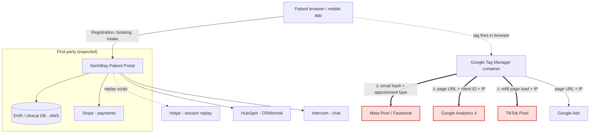

# 03 — Data Flow Map

The point of a data flow map is to make the invisible visible. Everyone assumes patient data goes patient → NorthBay → EHR. The problem is the branch nobody drew: patient → NorthBay's web page → and *simultaneously* → ad and analytics vendors, in real time, via tags in the browser.

Below is the flow. The red path (marked with ⚠) is the problem.

## Reading the map

- **The first-party path is fine.** Patient data flowing into NorthBay's own portal, EHR, and to Stripe for payment is expected and covered.
- **The tag-manager path is the exposure.** Google Tag Manager is loading tags in the patient's browser that fire on sensitive pages and ship data straight to third parties. This happens client-side, so it never shows up in a review of NorthBay's own servers. You only see it by watching the browser's outbound network traffic.
- **The three red edges are the Critical findings.** Each one is PHI going to a vendor with no BAA and no permissible basis.

## The specific disclosure that matters most

When a patient books a behavioral-health appointment, the confirmation page loads. In that instant:

1. The Meta Pixel fires, sending Meta an event that includes a hashed email (D-02) and, through the page context and event parameters, the fact that this was a behavioral-health booking (D-06).
2. GA4 records the page URL, which contains the service line, along with the GA client ID and the IP address (D-04, D-11).

Meta now knows that the person behind that email sought behavioral-health care. That is precisely the disclosure the FTC went after BetterHelp for. It is invisible to the patient and, until you do this mapping, invisible to NorthBay.
