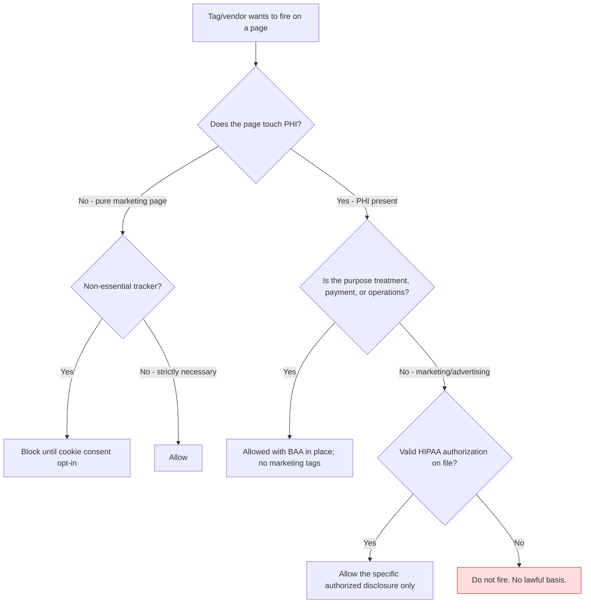

# 08 — Consent & Authorization Workflow

The consent gate is the control that would have prevented every Critical finding. Here's the logic I'd put in front of any non-essential tracker, and where HIPAA authorization comes in versus ordinary cookie consent.

## First, the distinction that matters

- **Cookie/consent banners** handle non-essential trackers for the general web (analytics, ads). This is what most state privacy laws and the FTC expect.
- **HIPAA authorization** is a higher bar. If a disclosure of PHI isn't for treatment, payment, or operations, the Privacy Rule generally requires a valid, specific authorization from the patient. A generic cookie "Accept" is **not** a HIPAA authorization.

The mistake to avoid: assuming a cookie banner "Accept All" gives you the right to send behavioral-health booking data to Meta. It does not. Some disclosures can't be consent-banner'd into compliance; they need real authorization or they simply don't happen.

## The decision flow

## How it plays out for NorthBay's findings

- **Meta Pixel on the behavioral-health confirmation page (F-01):** PHI page, purpose is advertising, no authorization → **do not fire.** A banner can't save this.
- **GA4 on all pages (F-02):** allowed only after PHI is stripped from what it ingests and a data-processing agreement is confirmed; gated behind consent on non-PHI pages.
- **Marketing pixels on the public homepage:** allowed after cookie opt-in, because no PHI is present there.

## Implementation notes

1. **Default deny.** Non-essential tags do not load until a decision resolves. This is the opposite of the current "load everything on page load" setup.
2. **Server-side tagging** gives NorthBay a chokepoint to enforce these rules, instead of trusting client-side tags to behave.
3. **Log the consent state** with the event so there's an audit trail of what basis each disclosure relied on.
4. **Re-prompt on material change.** New vendor or new purpose means the prior consent doesn't cover it.

The workflow isn't complicated. What makes it work is that it runs *before* a tag can fire, and that someone owns the "does this page touch PHI" question. That ownership is the whole game.
